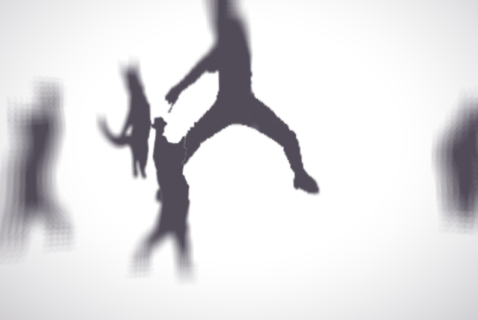

# Theatre-esque light & shadow shader effect
(Couldn't find a better word for this :/)


# Technical stuff
<br>
***This is the source image (overlaid on top of the checkerboard BG), We're going to use this to generate light, shadow and composite buffer.***

<br>
***We feed the source buffer into the shader to render the light buffer.***

We first fill the whole buffer with black, So that we can just apply an additive blending mode when constructing the composite buffer.
<br>Then using the distance from the center of screen, We can generate a radial gradient.
<br>We generate two versions of radial gradient : One with "hard" and small radius for foreground, Other one with "smooth" and large radius for background.
<br>Notice how the opaque part / foreground gets more light than a background part, We're basically mixing between two gradients with input buffer's alpha like this :
``` glsl
// mix both so only foreground part (aka the parts with alpha) gets foreground lighting and same goes for background
gl_FragColor = mix(lightBG, lightFG, texture2D( gm_BaseTexture, v_vTexcoord ).a);
```

<br>
***Almost same thing happens with shadow buffer.***
<br>We're using the distance from the screen's center to apply a vignette effect..
<br>Also, We're applying a blur effect to make the parts close to the screen's edge blurry.
<br>But here's the twist : we're using a technique called "dithering" to compensate the artifact generated from using lesser texture samples.

<br>
***Blur effect shader can be quite expensive if you sample the texture too much. But if you don't sample the texture too much, It will get "chunky" like the picture above...***

<br>
***That's why we're using the dithering to make the result smooth. Using a noise texture, We can offset the sampling uv coordinates with a random noise value.. Using that, We can get improved blur effect with lesser texture sampling; That means we can save those precious FPS!***

<br>
***Using those buffers, We can finally construct the composite image by rendering a shadow buffer on background with multiplicative blend mode, And drawing a source buffer on top of it, Then rendering a light buffer with additive blending mode.***
<br>Following snippet of code renders a composite image :
``` gml
// draw shadow buffer with multiplicative blend mode
draw_set_blend_mode_ext(bm_zero, bm_src_colour);
draw_surface(surfShadow, 0, 0);

// draw source buffer with normal blending
draw_set_blend_mode(bm_normal);
draw_surface(surfSrc, 0, 0);

// draw light buffer with additive blend mode
draw_set_blend_mode_ext(bm_one, bm_one);
draw_surface(surfLight, 0, 0);

// reset blend mode
draw_set_blend_mode(bm_normal);
```
